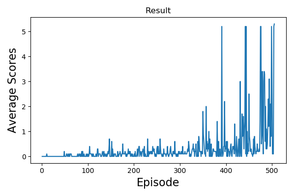

# Project03: Multi-Agents RL for tennis game
---

## Introduction
Solving the [Unity Tennis Game](https://github.com/Unity-Technologies/ml-agents/blob/master/docs/Learning-Environment-Examples.md#tennis) with Multi-agents environment.

In this environment, two agents were playing the tennis together. The goal of the game is to keep a ball bounce between rackets and won't fall on the ground.  

State
* For each agent, 8 variables corresponding to the position and velocity of the ball and racket. Note, each agent receives its own local observation.

Action
* For each agent, two continuous actions are available: 1) movement toward/away the net, 2) jumping. The action space for all actions are ranged from -1 to +1.

Reward
* +0.1 if the bounce the ball successfully. -0.01 if the ball hit the ground or hit the ball out of bounds.

### Goal
The final goal is considered as solved when reaching +0.5 scores over 100 consecutive episodes. (after taking the maximum over both agents)

## Setup
1. Clone the [repo](https://github.com/vashineyu/DRL_Project03_MultiAgentRL)
2. `./build_env.sh`

## Run
1. The main file is [run.py](./run.py) To reporduce the result: `python run.py`
2. The agent setting is placed at [maddpg.py](./maddpg.py) and the model setting is placed at [model.py](./model.py)

## Implementation details

## Results
Solved version

## Ideas for future works
