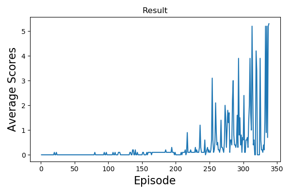

# Project03: Multi-Agents RL for tennis game
---

## Introduction
Solving the [Unity Tennis Game](https://github.com/Unity-Technologies/ml-agents/blob/master/docs/Learning-Environment-Examples.md#tennis) with Multi-agents environment.

In this environment, two agents were playing the tennis together. The goal of the game is to keep the ball bounce between agent's rackets and won't fall on the ground or hit out of bounds.  

State
* For each agent, 8 variables corresponding to the position and velocity of the ball and racket. Note, each agent receives its own local observation.

Action
* For each agent, two continuous actions are available: 1) movement toward/away the net, 2) jumping. The action space for all actions are ranged from -1 to +1.

Reward
* +0.1 if the bounce the ball successfully. -0.01 if the ball hit the ground or hit the ball out of bounds.

### Goal
The final goal is considered as solved when reaching +0.5 scores over 100 consecutive episodes. (after taking the maximum over both agents)

## Setup
1. Clone the [repo](https://github.com/vashineyu/DRL_Project03_MultiAgentRL)
2. `./build_env.sh`

## Run
1. The main file is [run.py](./run.py) To reporduce the result: `python run.py`
2. The agent setting is placed at [maddpg.py](./maddpg.py) and the model setting is placed at [model.py](./model.py)

## Implementation details
The DDPG algorithm was used to solved the game. For the actor network, the states will pass through two agent's actor network and give actions separately. And for the critic network, states of two agents observed individually were concatenated and served as critic network's input. Both the actor and the critic networks were built up with 3 layers. We trained the network up to 2000 episode. Fortunately, the environement was solved after around five to six hundreds of episodes.  
The implementation details such as hyper-parameters can be found in [report.pdf](./report.pdf)

## Results
Solved version
#### 2 layers, 128 units per layer

#### 4 layers, 128 units per layer

